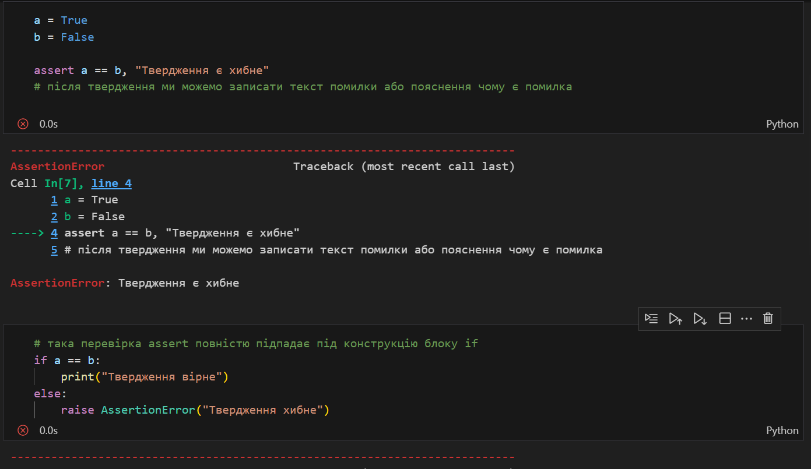

# Звіт до роботи №3
## Тема: _Робота з тестами в Python_
### Мета роботи: _Навчитись створювати тести та за допомогою них перевіряти правильність виконання програм_

---
### Виконання роботи
* Результати виконання завданнь:
    1. Створили [Пайтон Ноутбук](./nb.ipynb) де будемо працювати з базовими конструкціями тестів;
    1. Почали використовувати твердження `assert` та продемонстрували, як у нас виникає помилка при не виконання твердження 
    1. ...

---
### Висновок:
> у висновку потрібно відповісти на запитання:

- :question: Що зроблено в роботі;
- :question: Чи досягнуто мети роботи;
- :question: Які нові знання отримано;
- :question: Чи вдалось відповісти на всі питання задані в ході роботи;
- :question: Чи вдалося виконати всі завдання;
- :question: Чи виникли складності у виконанні завдання;
- :question: Чи подобається такий формат здачі роботи (Feedback);
- :question: Побажання для покращення (Suggestions);

---